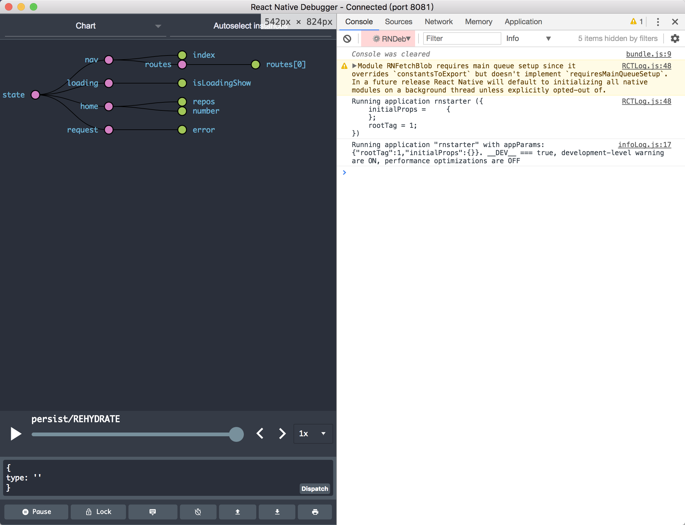

## React Native 开发总结


### 前言

2015年3月, Facebook正式发布react-native，只支持iOS平台；2015年9月，Facebook发布了React Native for Android，让这一技术正式成为跨平台开发框架。   

我们团队是在2016年中期开始接触并使用react-native, 起初团队有很多反对声，其中
* iOS平台严格的审核制度，还有后来的JSPatch风波，担心有热更新的能力的react-native也会被警用，还好react-native是以js.bundle为资源加载的沙盒热更新。 
* React Native的性能能达到上限问题

当时选择react-native的几个重要因素  

* 跨平台：这可能是最重要的原因了，可以节省人月
* 基于React框架开发，组建化，响应式思路，调试方式可以缩短开发周期（在开发者熟练使用的情况下），也可以调整前端开发资源
* 热更新：APP当时修复BUG基本都是重新发版，周期比较长，热更新是解决这一个痛点是最好的选择
* 新技术调研，扩展技术栈

### 移动框架学习套路

每次接触一个新技术，新框架总是一头雾水。其实是有套路的，有经验的程序员会说这就是思想
主要从移动开发这几个方面调研

* 计算机语言工具
* 环境搭建
* UI绘制
* 基本布局方式
* 基本tab + navigator的APP框架搭建
* 网络请求(http, https, 上传，下载等)
* 缓存, 本地存储
* 图片
* 平台特性处理：例如推送，支付等等iOS，安卓不同的平台代码如何处理
* 调试工具：好的调试工具不但可以事半功倍，还可以给开发者愉悦的心情开发
* 静态代码检查（这个对于解释型的JS语言很重要）
* Unit Test
* CI集成方式

以上几个方面都研究明白了，整个react-native生产链路就调研完成了

### 技术栈

针对上面的过程总结一下技术栈

#### 需要的语言&框架

**1.1 javascript - [ECMAScript6](http://es6.ruanyifeng.com/#docs/object) :**React Native 是以javascript作为语言工具开发; 

**1.2 React :** 起源于 Facebook 的内部项目, 因为该公司对市场上所有 JavaScript MVC 框架，都不满意，就决定自己写一套，用来架设 Instagram 的网站。做出来以后，发现这套东西很好用，在2013年5月开源. 由于 React 的设计思想极其独特，属于革命性创新，性能出众，代码逻辑却非常简单。所以，越来越多的人开始关注和使用，认为它可能是将来 Web 开发的主流工具;   

简单直观、符合习惯的（idiomatic）方式去编程，让代码更容易被理解，从而易于维护和不断演进。这正是React的设计哲学。

**1.3 [flex 布局](https://reactnative.cn/docs/0.51/layout-with-flexbox.html#content) :**  布局方式;

**1.4 [redux](http://cn.redux.js.org/index.html) :** JS 状态容器，提供可预测化的状态管理, 实现view & state 分离，开发体验超爽， 而且体小精悍(只有2K)

**1.5 [immutable.js](https://facebook.github.io/immutable-js/) :**  
[Pete Hunt](https://github.com/petehunt): Shared mutable state is the root of all evil（共享的可变状态是万恶之源）, 有人说 Immutable 可以给 React 应用带来数十倍的提升，也有人说 Immutable 的引入是近期 JavaScript 中伟大的发明, Facebook 工程师 Lee Byron 花费 3 年时间打造，与 React 同期出现。    
[Immutable 详解及 React 中实践](https://github.com/camsong/blog/issues/3)


#### 如何环境搭建

node.js RN的调试服务基于node服务器.   	  
npm js包管理工具.    
Yarn 是Facebook提供的替代npm的工具，可以加速node模块的下载。React Native的命令行工具用于执行创建、初始化、更新项目、运行打包服务（packager）等任务。    
react-native [环境搭建](https://facebook.github.io/react-native/docs/getting-started.html)

#### 如何UI绘制与布局

React Native 提供丰富的基础组件库，使用Flexbox布局规则。采用jsx更直观的表达用户界面结构。


```
import React, {Component} from 'react'
import {View, Text, Button, StyleSheet} from 'react-native'

export class Home extends Component {
  state = {
  	number: 0
  }
 
  _increase() {
    const { number } = this.state
	 this.setState({number: number + 1})
  }

  _decrease() {
    const { number } = this.state
	 this.setState({number: number - 1})
  }

  render() {
    const { number } = this.state

    return (
      <View style={styles.container}>
        <Text>Home</Text>
        <Button title="加" onPress={this._increase.bind(this)}/> 
        <Button title="减" onPress={this._decrease.bind(this)}/> 
        <Text>{number}</Text>
      </View>
    )
  }
}

let styles = StyleSheet.create({
  container: {
    flex: 1,
    backgroundColor: '#fff'
  }
})

```

上例绘制一个简单的页面, [View](https://facebook.github.io/react-native/docs/view)是最基础的UI组件，并且支持Flexbox布局。[Text](https://facebook.github.io/react-native/docs/text)是用于显示文本的组件。[Button](https://facebook.github.io/react-native/docs/button)从命名上就可以明确是按钮组件。StyleSheet 提供了一种类似 CSS 样式表的抽象。


#### 调试 

调试：开发流程中最重要的事情，下面两个工具给RN开发带来了超爽的体验
RN 调试工具：[react-native-debugger](https://github.com/jhen0409/react-native-debugger)   
redux 开发扩展插件：[redux-devtools-extension](https://github.com/zalmoxisus/redux-devtools-extension)



#### 静态代码检查 

javascript是解释型语言，编译过程只有词法分析和语法分析，并没有词法检查. eslint对于js的意义格外重要  
* 避免隐藏错误  
* 代码统一规范，提高可读性  
	
[eslint](https://eslint.org/) 		
[babel-eslint](https://github.com/babel/babel-eslint).   
[eslint-plugin-react](https://github.com/yannickcr/eslint-plugin-react)

#### 代码质量的保证

[redux unit test](https://redux.js.org/docs/recipes/WritingTests.html).对于actions & reduce校验不可少.    
[Jest](https://facebook.github.io/jest/docs/en/tutorial-react-native.html) 很棒的BDD。（PS：每当发现一个工具特别好用的时候，发现都是facebook开源的）。  
[fetch-mock](http://www.wheresrhys.co.uk/fetch-mock/). 异步单测不可少.  

#### CI 可以用以下工具

[travis-ci](https://travis-ci.org/). github最流行的CI工具之一.   
[circle-ci](https://circleci.com/) react-native github库使用的CI工具.   
[gitlab-ci](https://about.gitlab.com/features/gitlab-ci-cd/) 目前我司用的是gitlab ci

#### 转场：tab-navigator框架，流畅的转场动画对于APP体验很重要 

[react-navigation](https://reactnavigation.org). RN社区今后主推的方案是一个单独的导航库react-navigation，它的使用十分简单。    
性能上： 在原生线程上的Animated动画库，因而性能表现十分流畅。此外其动画形式和手势都非常便于定制.     

#### 状态管理： [redux](http://cn.redux.js.org/)

view 与 状态分离

Redux 由 Flux 演变而来，但受 Elm 的启发，避开了 Flux 的复杂性。 不管你有没有使用过它们，只需几分钟就能上手 Redux。

单向数据流：
应用中所有的 state 都以一个对象树的形式储存在一个单一的 store 中。 惟一改变 state 的办法是触发 action，一个描述发生什么的对象。 为了描述 action 如何改变 state 树，你需要编写 reducers。


#### 如何做网络请求

    
使用[fetch](https://facebook.github.io/react-native/docs/network)  

```
fetch('https://mywebsite.com/endpoint/', {
  method: 'POST',
  headers: {
    Accept: 'application/json',
    'Content-Type': 'application/json',
  },
  body: JSON.stringify({
    firstParam: 'yourValue',
    secondParam: 'yourOtherValue',
  }),
});
```

[react-native-fetch-blob](https://github.com/wkh237/react-native-fetch-blob) 更好数据传输工具

#### 如何本地存储：

[AsyncStorage](https://reactnative.cn/docs/0.51/asyncstorage.html#content)使用起来非常简单的Key-Value Coding, 返回Promise     

```

import { AsyncStorage } from 'react-native'
let kLoginInfo = '@login:info'

//存储
AsyncStorage.setItem(kLoginInfo, JSON.stringify(loginInfo))

//删除
AsyncStorage.removeItem(kLoginInfo)

//加载
AsyncStorage.getItem(kLoginInfo)

```
iOS内部是用一个json文件实现永久性存储， Android方面据官方了解是会尝试使用RocksDB，或退而选择 SQLite。

[集成redux存储](https://github.com/rt2zz/redux-persist)

也可尝试一下款平台数据库[realm](https://realm.io/docs/javascript/latest/v)

#### 热更新： 

React Native一个重要功能，支持热更新，苹果去年有过一次对热修复的严打，JSPatch惨遭扼杀，不过对于RN这样的沙盒热更新是可以的.  
微软的[hot-push](https://github.com/Microsoft/react-native-code-push)是个不错的工具。  
有条件的单位可以自己建热修复服务，下载bundle包

#### native组件开发：

React Native可能还没有相应的模块封装，但是提供native组件开发能力. 利用这种方式解决平台特性，支付，推送，face ID都可以封装成native组件来解决

[iOS原生模块](https://reactnative.cn/docs/native-modules-ios)    
[iOS原生UI组件](https://reactnative.cn/docs/native-components-ios/)    
[安卓原生模块](https://reactnative.cn/docs/native-modules-android/)  
[安卓原生UI组件](https://reactnative.cn/docs/native-components-android/)

#### rnstart
[rnstart](https://github.com/jeremyzj/rnstarter)是根据上面技术栈搭建的react native starter demo 工程


### 未来展望

react-native论成熟度，稳定性，RN 比 不上iOS 和 Android 原生,   
也存在很多奇怪的BUG，  
习惯了OC, Java语言开发的对于JS缺少类型系统很沮丧
手动操作动画依然无解.  
长列表性能问题无解    
手势操作不够灵活.    
iOS podfile维护也不给力.  
....
....
等等问题。  
很多单位采用模块化方案，让APP有RN的能力，让业务交互简单的模块来用react-native开发

但是facebook依然很努力了改变，在2018年对react-native有一次大的重构，目的更轻量化并能更好地适应现有的原生应用，更符合js的生态系统。  

对于移动开发者而言，react-native只是开发箱中其中一种工具。丰富自己工具箱，才能有更宽的视野，更多的开发思路。


